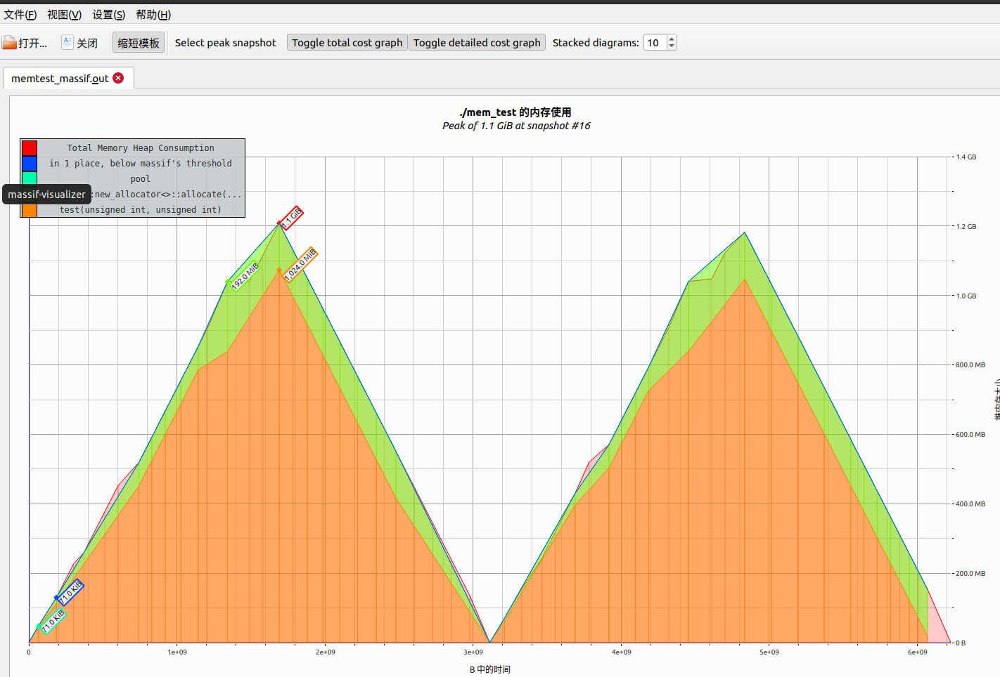
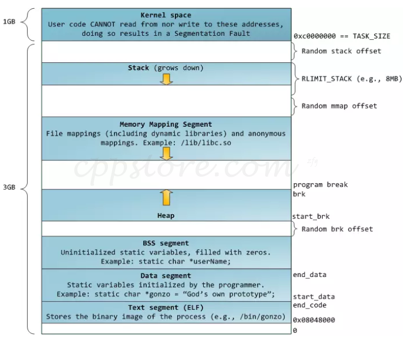

<center>free not return memory</center>
# 内存泄露？
观察到一台机器上的内存使用量在程序启动之后，持续增长，中间没有出现内存恢复。怀疑是不是出现了内存泄露的问题？

然后使用相关的内存分析工具进行了分析：

+ gperf
+ valgrind (massif)
+ 手工标记内存分配释放

上述的分析结果均不能很肯定的得出是否内存泄露的结论。那么问题可能出现在哪里呢？

程序采用 c++ 编写，大量使用了智能指针以及 new/delete，难道内存没有成功释放？亦或是内存释放有什么条件？于是开始怀疑 free 是不是真的释放了内存？


# 测试
既然怀疑 free 是不是真的释放了内存，此处的释放，是指程序内存占用下降，内存归还给操作系统，那么直接写一个简单的例子进行验证一下。

> attention:

测试前，先关闭 swap：

```
# swapoff -a

# free -h
              total        used        free      shared  buff/cache   available
Mem:           3.7G        2.5G        1.1G        8.8M         40M        959M
Swap:            0B          0B          0B
```

## 测试1
步骤如下：

1. 循环分配大量内存
2. block 程序，top 工具观察进程内存占用情况
3. 再循环释放所有分配的内存
4. block 程序，top 工具观察进程内存占用情况
5. 程序退出

上代码：

```
#include <string>
#include <cstring>
#include <iostream>
#include <vector>
#include <malloc.h>

void test(uint32_t num, uint32_t mem_size) {
    std::cout << "test: mem_size = " << mem_size << " total:" << num * mem_size / 1024.0 / 1024.0 << " MB" << std::endl;
    std::vector<char*> vec;
    // 3G
    for (uint32_t i =0; i < num; ++i) {
        char *ptr = new char[mem_size];
        vec.push_back(ptr);
    }

    std::cout << "allocate memory "<< num * mem_size / 1024.0 / 1024.0 <<  " MB done" << std::endl;
    for (auto& ptr : vec) {
        strncpy(ptr, "abcdefghij", mem_size);
    }


    std::cout << "input anything to continue delete all memory..." << std::endl;
    getchar();

    for (auto& ptr : vec) {
        delete ptr;
        ptr = nullptr;
    }

    std::cout << "release memory "<< num * mem_size / 1024.0 / 1024.0 <<  " MB done" << std::endl;
}

int main(int argc, char *argv[]) {
    uint32_t mem_size = 100;
    if (argc >=2) {
        mem_size = std::atoi(argv[1]);
    }
    uint32_t num = (uint32_t)2 * 1024 * 1024 * 1024 / mem_size;

    test(num, mem_size);

    std::cout << "input anything to exit" << std::endl;
    getchar();
    return 0;
}
```

编译：

```
g++ mem_test.cc -o mem_test -std=c++11
```

可以通过参数控制内存分配的大小，默认 100Byte：

```
./mem_test 100
./mem_test 500
./mem_test 1024
./mem_test 10240
```

过程就省略了，直接上观察结果：

+ 每次测试的虚拟内存大小是类似的，大概在 2G 左右
+ 单次分配内存长度为 100 Byte，调用 free 后内存无明显下降
+ 单次分配内存长度为 500,1024,10240...，调用 free 后内存迅速下降接近 0%
+ 多次测试临界值为 120 Byte


以上测试反应出**在不同的情况下， free 的行为有差异，但也说明，调用 free 之后内存是能够立即被释放给操作系统的**（只不过有条件）。


那为什么会出现调用 free 之后内存没有被释放（至少看起来是）的情况呢？


## 测试2
代码不变，还是上面的代码，只不过现在启动两个同样的程序：

1. 分别以上述不同的参数启动程序，让程序执行到释放所有内存之后，block 住
2. 然后启动第二个程序，用同样的参数
3. 观察两个进程是否都能存活

上述有一个条件假设：

> total mem: 4G，实际情况可以调整代码里分配内存的总量

过程也省略，直接上观察结果：

+ 单次分配内存 100 Byte，启动第二个同样的程序，出现 OOM （先启动这个被 kill)
+ 单次分配 500,1024,10240...， 启动第二个同样的程序，不会 OOM

上面的结果和测试1 的结果是吻合的，这能**肯定的说明出现 OOM 的场景下，第一个进程的内存虽然完全释放了，但是内存依然被该进程持有，操作系统无法把这部分已经调用 free 的内存重新分配给其他的进程**（第二个进程）。


## 测试3

稍微调整一下上面的代码，分配释放的操作进行两次，也就是上面的 `test()` 函数调用 2 次。

另外本次使用 valgrind(massif) 进行分析，此次单次内存分配大小为 100 Byte，也就是上面出现无法释放内存的参数。

```
int main() {
...
test();

test(); // call again
...
}
``` 

使用 valgrind 进行分析：

```
valgrind -v --tool=massif --detailed-freq=2 --time-unit=B --main-stacksize=24000000 --max-stackframe=24000000  --threshold=0.1  --massif-out-file=./massif.out ./mem_test
```

生成的文件 `massif.out` 使用 `massif-visualizer` 处理之后得到如下图：



上图就是内存分配的情况，从图中可以很明显的看到在第一次调用 `test()` 函数时，内存随着分配而增长，随着释放而下降；第二次调用 `test()` 函数也是同样的情况。

那这幅图能说明什么呢？

第一次调用 `test()`后，按照测试2 的情况，内存虽然被释放了，但是内存依然被进程持有，那么不应该出现内存下降的情况，但是从图中看，确实是下降到接近 0 了，那么可以得出一个结论：

**`test()` 至少是没有内存泄露的，即分配的内存，都被释放了（至少标记过释放），也就是没有出现野指针等内存泄露的情况**。

那么**问题就在于，既然没有内存泄露，那为何内存依然被进程持有？不是已经调用 free 了吗**？


# glibc malloc/free 实现
glibc malloc 底层调用的是 ptmalloc，这里就不深入 malloc/free 的实现细节了，网上可以找到很多资料。 

> 下图是 32 位程序的虚拟内存空间分布图



## 原理

向操作系统申请内存涉及到两个系统调用 sbrk 以及 mmap。关于这两个系统调用的区别可以大致这么理解:

+ **ptmalloc 管理了两块堆内存，所以有可能会在两个地方给用户分配内存**
+ **这两块堆内存的区别就在于一个可以被循环利用，一个在释放后立即归还操作系统**
+ **ptmalloc 使用 sbrk 来为第一块内存区域 heap 进行内存分配，用户释放之后 ptmalloc 对这块内存进行重新管理利用，进程依然持有这块内存**
+ **ptmalloc 使用 mmap 来为第二块内存区域 sub-heap 进行内存分配，用户释放之后 ptmalloc 立即把这块内存归还给操作系统**
+ **要分配的内存只有达到一定大小（即 mmap 的阈值），ptmalloc 才会采用 mmap 进行内存分配，否则优先选择 sbrk 分配后被重新管理的内存池**
+ **mmap 的阈值可能是动态调整的，即 ptmalloc 根据自身内存管理情况，动态调整这个阈值**


也就是说，**ptmalloc 为了性能考虑，采用了两种内存分配策略，也就是管理了两种不同分配方式的堆内存。在分配内存小于一定值时就优先在 ptmalloc 维护的内存池里进行分配，这样避免了直接向操作系统分配内存，减少系统调用次数；如果内存大于一定值时，就直接向操作系统申请内存，并且这段内存在释放之后立即归还操作系统**；

这也就能解释上面的几个测试里，当单次分配的内存大小较大时，内存释放后进程内存占用快速下降到 0%；当单次分配的内存大小较小时，内存释放后其实没有归还给操作系统，二是被 ptmalloc 重新回收了，放到了内存池里进行循环利用，所以看到进程内存依然保持较高的占用；

另外关于 ptmalloc 对内存池的管理比较复杂，这里推荐一篇不错的文章可以深度阅读：

[glibc内存管理ptmalloc源代码分析](https://paper.seebug.org/papers/Archive/refs/heap/glibc%E5%86%85%E5%AD%98%E7%AE%A1%E7%90%86ptmalloc%E6%BA%90%E4%BB%A3%E7%A0%81%E5%88%86%E6%9E%90.pdf)


到这里，其实就已经比较明确了，free 之后内存释放情况其实是跟分配的大小有关系的，并且随着程序的运行，内存的持续分配和释放，ptmalloc 的内存池应该能稳定在一定的值，从外面来看，进程的内存占用应该能动态稳定下来。

**ptmalloc 的两套分配策略各有优劣，使用内存池可以提高内存分配效率，但是可能出现内存暴涨的情况，但是最终会稳定在一定的值；使用 mmap 的方式分配内存不会出现内存暴涨的情况，释放完之后理解归还操作系统，但降低了内存分配的效率**。

## 修改 malloc 参数

根据上面的讨论，如果想要控制 malloc 的内存分配行为，那么其实是有办法做到的。

我们可以通过下面这个函数来实现：


```
int mallopt(int param, int value);
```

[https://man7.org/linux/man-pages/man3/mallopt.3.html](https://man7.org/linux/man-pages/man3/mallopt.3.html)

**可以调整 M\_TRIM\_THRESHOLD，M\_MMAP\_THRESHOLD，M\_TOP\_PAD 和 M\_MMAP\_MAX 中的任意一个，关闭 mmap 分配阈值动态调整机制**。

比如上面的测试1，当单次分配的内存 100 Byte 时，内存释放之后进程内存占用依然较高的情况就能解决：

```
int main() {
    mallopt(M_MMAP_THRESHOLD, 64);
    mallopt(M_TRIM_THRESHOLD, 64);
    
    ...
}
```

+ M\_MMAP\_THRESHOLD: mmap 内存分配阈值
+ M\_RIM\_THRESHOLD: mmap 收缩阈值

在 main 函数开始加上上面的两句，调整 mmap 收缩阈值以及内存分配阈值。重新编译运行，发现即使单次分配 100 Byte，内存释放后，进程内存占用也快速下降到 0%。

补充：

```
int malloc_trim(size_t pad);
```

可以触发 ptmalloc 对内存的紧缩，即归还一部分内存给操作系统。


# 总结
进程内存占用较高的情况不一定是内存泄露造成的，可以通过长时间观察内存占用是否能稳定下来进行判断，如果内存占用能实现动态稳定，那么多半程序是没有内存泄露的。

但是如果内存占用过高，对其他的进程产生了干扰，那么可以适当的调整一下 malloc 的参数，控制 malloc 的行为，避免 glibc 内存池过大，影响其他进程的运行。
